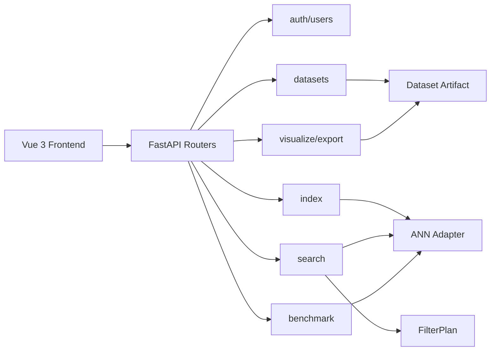

# 二、需求分析与系统设计

## 2.1 需求分析

系统面向单细胞高维向量数据的近似最近邻检索，核心用户包括普通查询用户、研究者和管理员。

- 管理员负责用户审核、账号状态管理和系统维护。
- 研究者负责数据集注册、向量预处理、索引构建、算法评测和结果导出。
- 普通用户负责按细胞 ID、原始向量或元数据条件进行检索，并查看可视化结果。

核心功能分为七条主线：

- 用户与权限：注册、登录、审核、管理员用户管理。
- 数据集管理：注册 `.h5ad` 数据源，抽取 embedding、cell id 和 `obs` 元数据，并持久化为 Dataset Artifact。
- 索引管理：基于 Dataset Artifact 构建 ANN Index，并记录算法参数、构建耗时和索引大小。
- 检索查询：支持按 cell ID、向量、批量 cell ID 进行 Top-K 检索，支持 `obs` 条件过滤。
- 策略对比：对 post-filter、pre-filter、hybrid filter 进行 recall、延迟和返回数量对比。
- 性能评测：在同一数据集和同一查询采样下对多个 ANN 算法进行批量 benchmark。
- 可视化与导出：生成 embedding 可视化、检索结果导出和 benchmark 导出。

## 2.2 系统设计

后端采用 FastAPI 分模块组织，公开路由保持稳定，复杂行为收敛在 service 和算法 Adapter 中。

当前技术栈：

- 后端：FastAPI、SQLAlchemy、Pydantic。
- ANN：FAISS 系列索引与 hnswlib。
- 数据库存储：开发阶段使用 SQLite，保留迁移到 PostgreSQL 的空间。
- 文件工件：向量、细胞 ID、元数据和索引文件保存到后端配置目录。
- 前端：Vue 3、Vite、TypeScript、Ant Design Vue、Plotly。

关键设计约束：

- 向量和元数据分离保存，索引内部 ID 与 `cell_ids.npy` 行号保持一致。
- 后端路由不直接理解算法细节，算法差异由 ANN Adapter 消化。
- 条件过滤统一走 FilterPlan，避免数据集浏览、检索和策略对比语义不一致。
- `/search/batch` 表示同一索引内多查询聚合，不等价于 Multi-Dataset Search；跨数据集检索使用 `/search/multi-dataset`。

## 2.3 详细设计

### 数据集流程

1. 用户提交数据集名称、源文件路径和 embedding key。
2. 后端读取 `.h5ad`，从 `obsm[embedding_key]` 抽取向量，从 `obs_names` 抽取 cell ID，从 `obs` 抽取元数据。
3. 后端落盘 `vectors.npy`、`cell_ids.npy`、`obs.parquet`，并将数据集状态置为 `ready`。
4. 后续切换 embedding 时，旧索引会被级联删除，避免索引维度和向量工件不一致。

### 索引流程

1. 研究者选择数据集、算法和参数。
2. 后端加载向量工件，通过算法工厂创建 ANN Adapter。
3. Adapter 构建索引并保存到磁盘。
4. 索引元数据记录构建时间、索引大小、向量数量、向量维度和状态。

### 检索流程

1. 查询请求进入 `/search/by-cell`、`/search/by-vector` 或 `/search/batch`。
2. 后端加载 ready 索引、对应数据集工件和 `obs` 元数据。
3. FilterPlan 计算过滤条件命中的行集合和选择率。
4. ANN Adapter 执行召回，后处理阶段排除查询自身、应用过滤并组装 hit。
5. 返回 `cell_id`、`row_index`、`distance` 和对应 `obs`。

### 多数据集检索流程

1. 查询请求进入 `/search/multi-dataset`，携带多个 `index_ids`。
2. 如果按 cell ID 查询，后端先通过 `source_index_id` 定位查询向量；如果按向量查询，直接使用请求中的 vector。
3. 后端逐个目标索引检索，并为每个 hit 补充 `dataset_id`、`index_id`、`algorithm`。
4. 对所有候选 hit 按距离全局排序，返回前 Top-K。
5. 对维度不匹配的索引，记录到 `skipped[]`，不中断整次请求。

### 性能评测流程

1. 评测请求指定数据集、算法列表、Top-K、查询数量和随机种子。
2. 后端固定抽样查询集合。
3. `flat` 精确检索生成 ground truth。
4. 每个算法独立构建临时索引并查询全部样本。
5. 系统记录 recall@k、平均延迟、分位延迟、QPS、构建时间和索引大小。

### 后续扩展点

- Multi-Dataset Search：定义跨数据集查询契约、分数归一化和结果合并策略。
- ANN 算法改进：在 ANN Adapter 层新增算法或优化参数，不影响路由层。
- RAG：以检索结果作为候选上下文，增加自然语言解释和辅助分析。
- 长任务：将数据集预处理和索引构建从同步请求迁移到任务队列或后台任务。

## 2.4 数据库设计

主要表：

- `users`：账号、角色、审核状态和账号状态。
- `datasets`：数据集名称、源路径、工件路径、细胞数、基因数、向量维度、embedding key 和处理状态。
- `indexes`：数据集 ID、算法、参数、索引文件路径、状态、构建耗时、索引大小和向量维度。
- `benchmark_batches`：一次评测批次的标签、数据集、Top-K、查询数量和随机种子。
- `benchmark_results`：某批次中单个算法的 recall、延迟、QPS、构建耗时和索引大小。

设计原则：

- Dataset 与 Index 通过 `dataset_id` 关联。
- 删除数据集时级联标记删除相关索引，并清理磁盘工件。
- Benchmark 使用独立表，不污染用户可见的 Index 列表。
- 大型向量矩阵不直接存入关系数据库，关系数据库只保存元信息和文件路径。

## 2.5 UI 设计

前端以后台工作台为主，不做营销型入口页。

主要页面：

- 登录与账号状态页。
- 仪表盘：展示系统入口和近期数据。
- 用户管理页：管理员审核与账号管理。
- 数据集管理页：注册数据集、查看状态、切换 embedding、删除数据集。
- 索引管理页：选择数据集和算法参数，构建或删除索引。
- 检索页：按 cell ID 或向量检索，配置 Top-K、metric 和条件过滤。
- 多查询页：同一索引内多个 cell ID 的聚合检索。
- 性能评测页：配置算法列表并查看 recall、latency、QPS、index size 对比。
- 可视化页：展示 2D/3D embedding，点击点后联动检索。
- 导出页：导出检索结果和 benchmark 结果。
